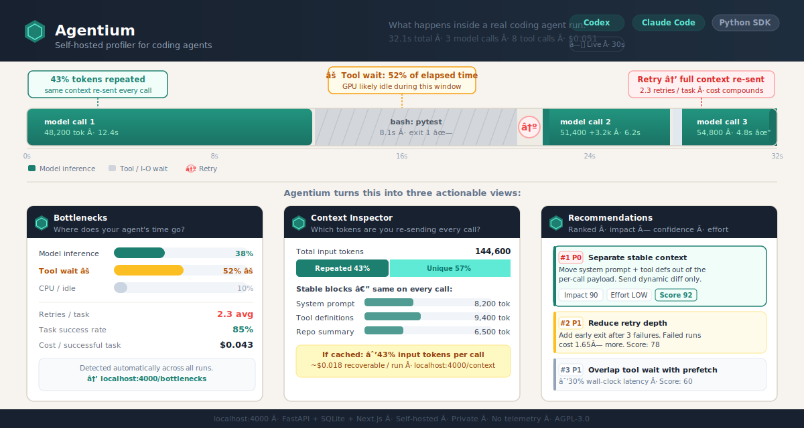

# Agent Runtime Layer

Self-hosted profiler for coding-agent traces, bottlenecks, context waste, and optimization evidence.

Agent Runtime Layer helps developers answer:

- Why is this coding agent slow?
- Where did model cost go?
- How much context is repeated on every model call?
- Are tools, retries, or orchestration causing idle time?
- Which optimization should I try next, and what evidence supports it?

It runs locally with FastAPI, SQLite, and a Next.js dashboard.

## Preview



Import a trace, inspect bottlenecks, and generate optimization evidence from a self-hosted dashboard.

## Current Status

Developer preview.

The core local product works end to end: trace import, command capture, SDK instrumentation, Codex native capture, Claude Code native capture, dashboard analysis, bottleneck detection, context inspector, cost explorer, optimization recommendations, context optimizer, benchmark evidence records, and Workload Reports.

This project does **not** claim real KV-cache control, production scheduler behavior, hardware simulation, or measured hardware speedups.

## Prerequisites

- [Docker Desktop](https://www.docker.com/products/docker-desktop/) (for the backend and dashboards)
- Python 3.10+ (for the `agent-runtime` CLI and SDK)
- [Codex CLI](https://github.com/openai/codex) or [Claude Code](https://claude.ai/code) (for the respective integrations)

Install the `agent-runtime` CLI:

```bash
cd packages/sdk-python
pip install -e .
```

On Windows (PowerShell):

```powershell
cd packages\sdk-python
pip install -e .
```

## Quickstart

```bash
docker compose up --build
```

Open the dashboard:

```text
http://localhost:4000
```

Backend API:

```text
http://localhost:8000/docs
```

## Supported Integrations

### Codex

Install repo-local Codex hooks in the repository where you run Codex:

```bash
agent-runtime integrations install codex --repo .
```

Then run Codex normally. Agent Runtime Layer captures Codex hook events into the local dashboard when the backend is running.

For live validation when project-local hooks are not loading, use global Codex hooks:

```bash
agent-runtime integrations install codex --global
```

If a Codex CLI mode does not fire hooks on your platform, import the completed Codex session JSONL after the run:

```bash
agent-runtime codex-session ~/.codex/sessions/YYYY/MM/DD/rollout-....jsonl --project codex-live --upload
```

See [Codex Native Capture](docs/integrations/codex.md) and the [Codex Validation Demo](docs/integrations/codex-validation-demo.md).

### Claude Code

Install Claude Code hooks in the repository where you run Claude Code:

```bash
agent-runtime integrations install claude-code --repo .
```

Then run Claude Code normally. Each turn is captured as a task trace including prompt, tool calls, file changes, terminal output, and stop events.

Check status or remove:

```bash
agent-runtime integrations status claude-code --repo .
agent-runtime integrations uninstall claude-code --repo .
```

See [Claude Code Native Capture](docs/integrations/claude-code.md).

### Custom Agents — Python SDK

```python
from agent_runtime_layer import AgentRuntimeTracer, prompt_hash

with AgentRuntimeTracer(task_name="custom agent task") as trace:
    trace.log_context_snapshot(
        size_tokens=12000,
        repeated_tokens_estimate=3000,
        context_kind="repo_summary_plus_tool_schema",
    )

    with trace.model_call(
        model="claude-3-5-sonnet",
        role="planner",
        estimated_input_tokens=12000,
        expected_output_tokens=600,
        prompt_hash_value=prompt_hash("plan the fix"),
    ) as call:
        call.finish(input_tokens=12000, output_tokens=520, cost_dollars=0.02)

    with trace.tool_call(tool_name="terminal", command="pytest tests/") as tool:
        tool.finish(status="success", exit_code=0, payload={"stdout_preview": "passed"})
```

## Golden Demo

Click **Start demo** on the homepage at `http://localhost:4000`.

The demo imports a bundled coding-agent trace where an agent:

1. plans a checkout tax fix
2. runs a failing test
3. observes terminal output
4. repeats stable repo and tool context
5. calls the model again to repair the issue
6. edits one file
7. reruns tests successfully

The app then generates:

- execution graph
- timeline and event table
- bottleneck report
- repeated-context analysis
- estimated model cost
- optimization recommendations
- prefix-cache-ready context package
- Workload Report

The demo shows the core value: **evidence-backed diagnosis for why a coding-agent run is slow or expensive, and what optimization to try next.**

## What You Can Do

### Import Traces

```bash
curl -X POST http://localhost:8000/api/traces/import \
  -H "Content-Type: application/json" \
  --data-binary @examples/sample-traces/repeated-context-task.json
```

### Capture Local Commands

```bash
cd packages/sdk-python
python -m agent_runtime_layer.cli trace --name "hello test" -- python -c "print('hello')"
python -m agent_runtime_layer.cli import .agent-runtime/traces/<task_id>.json
```

Upload in one step:

```bash
python -m agent_runtime_layer.cli trace --name "hello test" --upload -- python -c "print('hello')"
```

### Generate Optimization Evidence

```bash
curl http://localhost:8000/api/tasks/<task_id>/optimizations
curl -X POST http://localhost:8000/api/tasks/<task_id>/optimize-context
```

The dashboard shows stable context blocks, dynamic context blocks, estimated token reduction, estimated cost reduction, and an optimized prompt and context package.

### Generate a Workload Report

```bash
curl -X POST http://localhost:8000/api/phase-1-exit/generate
```

Open:

```text
http://localhost:4000/recommendations
```

The Workload Report summarizes local evidence, recommendations, metric quality, cost and savings, and next validation steps.

## Dashboard

Open `http://localhost:4000` after starting with Docker Compose.

| Route | What it shows |
|---|---|
| `/` | Landing page — what Agentium does and how to get started |
| `/overview` | Live agent health — hero metrics, time split, detected patterns |
| `/runs` | All traced runs with status, cost, retries, and repeated context % |
| `/runs/<id>` | Run detail — waterfall timeline, context growth, event feed |
| `/bottlenecks` | Time and cost bottleneck analysis with plain-English pattern cards |
| `/context` | Context inspector — stable vs dynamic token breakdown per run |
| `/cost` | Cost explorer — cost per task, cost per failure, before/after comparison |
| `/recommendations` | Ranked action list with impact, confidence, and effort scores |
| `/import` | Integration guides and trace import instructions |

The dashboard auto-refreshes every 30 seconds with a live indicator.

## Architecture

```text
Coding agents
  - Codex (hooks)
  - Claude Code (hooks)
  - Custom agents (Python SDK)
  - Imported traces (JSON)
        |
        v
FastAPI backend + SQLite
  http://localhost:8000
        |
        v
  Agentium dashboard
  http://localhost:4000
```

See [docs/ARCHITECTURE.md](docs/ARCHITECTURE.md).

## Documentation

- [Quickstart](docs/QUICKSTART.md)
- [Architecture](docs/ARCHITECTURE.md)
- [Codex Native Capture](docs/integrations/codex.md)
- [Codex Validation Demo](docs/integrations/codex-validation-demo.md)
- [Claude Code Native Capture](docs/integrations/claude-code.md)
- [Limitations](docs/LIMITATIONS.md)
- [API spec](docs/API_SPEC.md)
- [Trace schema](docs/TRACE_SCHEMA.md)
- [Security and privacy](docs/SECURITY_PRIVACY.md)

## Validation

Backend tests:

```bash
cd backend
PYTHONPATH=. python -m pytest tests
```

Frontend build:

```bash
cd frontend
npm ci
npm run build
```

Docker smoke test:

```bash
docker compose up --build -d
curl http://localhost:8000/api/health
```

Expected:

```json
{"status":"ok"}
```

## Privacy

Agent traces can contain sensitive prompts, file paths, terminal output, tool results, and project metadata.

By default:

- data is stored locally in SQLite
- no product telemetry is sent
- obvious secrets are redacted before persistence where possible

Review traces before sharing them publicly.

## Limitations

Agent Runtime Layer currently does not provide:

- hosted SaaS
- production authentication
- billing
- official SWE-bench runner
- real KV-cache control
- direct vLLM, SGLang, Dynamo, or LMCache integration
- production scheduling
- live GPU polling
- hardware simulation
- RTL, FPGA, ASIC, or chip design output

See [docs/LIMITATIONS.md](docs/LIMITATIONS.md).

## Contributing

See [CONTRIBUTING.md](CONTRIBUTING.md).

## License

AGPL-3.0-or-later. See [LICENSE](LICENSE).

Agent Runtime Layer is free to use, self-host, modify, and contribute to under the GNU Affero General Public License v3.0 or any later version. Commercial licensing may be offered later for teams that need proprietary embedding, hosted-service use, or custom terms.
